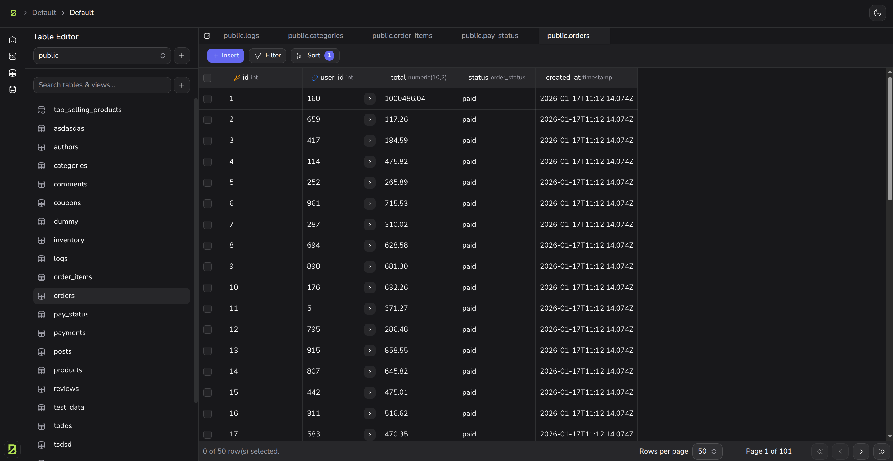
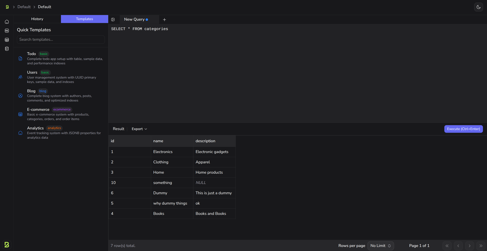
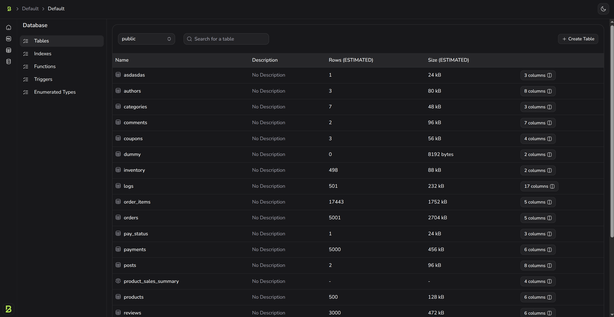

<p align=center>
 
</p>

<h3 align=center>Bunvel</h3>
<p align=center>The fastest open-source backend platform</p>

<p align=center>
    <a href=https://bunvel.com/docs>Documentation</a> | <a href=https://discord.gg/YKa9jqbh>Discord</a> | <a href=https://twitter.com/bunvelhq>Twitter</a>
</p>

<br>

<p align=center>Bunvel is a Backend-as-a-Service (BaaS) platform that combines authentication, real-time subscriptions, storage, and REST APIs. Built on [Elysia](https://elysiajs.com) and [Bun](https://bun.sh), it delivers high performance with lightweight containers and minimal resource usage.</p>

<br>

> **Note:** This is currently a hobby project for learning and understanding backend concepts. It is not yet production-ready, but with community contributions, it may evolve into a production-ready solution in the future.

## ✨ Features

- 🔐 **Authentication** - Auth with email/password (coming soon)
- 💾 **Storage** - File upload/download with bucket management (coming soon)
- ⚡ **Realtime** - WebSocket subscriptions for live data updates (coming soon)
- 🔌 **REST API** - Auto-generated REST APIs from your database schema
- 🎨 **Studio** - Beautiful admin dashboard built with TanStack Start

<p align=center>
 
 
 
</p>

## 🏗️ Architecture

Bunvel consists of two main components:

- **Backend (`app/`)** - Elysia-based API server handling all services
- **Studio (`studio/`)** - TanStack Start admin dashboard for management

## 🚀 Quick Start

### Prerequisites

- Bun >= 1.3.5
- PostgreSQL >= 18

### Development

```bash
git clone https://github.com/bunvel/bunvel.git

cd bunvel

# Start the services
docker compose -f docker-compose-dev.yml up --build
```

### Self Host

```bash
git clone --depth 1 https://github.com/bunvel/bunvel.git

# Create a new project directory
mkdir bunvel-project

# Copy the docker files to your project
cp -rf bunvel/docker/* bunvel-project

# Copy the example environment file
cp bunvel/docker/.env.example bunvel-project/.env

# Switch to your project directory
cd bunvel-project

# Start the services
docker compose up -d
```

The backend will be available at `http://localhost:8000` and the studio at `http://localhost:3000`.

### REST API Access

The auto-generated REST API is accessible at `http://localhost:8000/rest`.

For detailed API usage and capabilities, refer to the [PostgREST documentation](https://docs.postgrest.org/en/v14/).

**Note:** As of now, there is no authentication implemented, so all endpoints are publicly accessible.

## 🌟 Inspiration

Bunvel is inspired by [Supabase](https://supabase.com) but takes a different architectural approach by consolidating all services into a single, unified application for improved performance and simpler deployment.

Built with ❤️ using [Bun](https://bun.sh), [Elysia](https://elysiajs.com), and [TanStack Start](https://tanstack.com/start)
