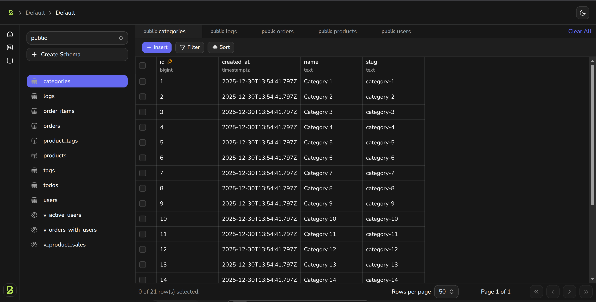

# Bunvel

**The fastest open-source backend platform**

Bunvel is a unified Backend-as-a-Service (BaaS) platform that combines authentication, real-time subscriptions, storage, and REST APIs into a single, high-performance service built on [Elysia](https://elysiajs.com) and [Bun](https://bun.sh).

> **Note:** This is currently a hobby project for learning and understanding backend concepts. It is not yet production-ready, but with community contributions, it may evolve into a production-ready solution in the future.

## ✨ Features

- 🔐 **Authentication** - Auth with email/password
- 💾 **Storage** - File upload/download with bucket management and CDN integration
- ⚡ **Realtime** - WebSocket subscriptions for live data updates
- 🔌 **REST API** - Auto-generated REST APIs from your database schema
- 🎨 **Studio** - Beautiful admin dashboard built with TanStack Start
- 🚀 **Single Service** - Everything runs in one unified application for maximum performance



## 🏗️ Architecture

Bunvel consists of two main components:

- **Backend (`app/`)** - Elysia-based API server handling all services
- **Studio (`studio/`)** - TanStack Start admin dashboard for management

## 🚀 Quick Start

### Prerequisites

- [Bun](https://bun.sh) >= 1.3.5
- PostgreSQL >= 18

### Development Setup

1. **Get the code**

```bash
git clone --depth 1 https://github.com/bunvel/bunvel.git

# Create a new project directory
mkdir bunvel-project

# Copy the docker files to your project
cp -rf bunvel/docker/* bunvel-project

# Copy the example environment file
cp bunvel/docker/.env.example bunvel-project/.env

# Switch to your project directory
cd bunvel-project

# Start the services
docker compose up -d
```


The backend will be available at `http://localhost:8000` and the studio at `http://localhost:3000`.

## 📚 Documentation

- [Architecture Overview](./docs/architecture.md)
- [API Documentation](./docs/api.md)
- [Development Guide](./docs/development.md)

## 🤝 Contributing

We love contributions! Please read our [Contributing Guide](./CONTRIBUTING.md) to get started.

## 🔒 Security

Please review our [Security Policy](./SECURITY.md) for reporting vulnerabilities.

## 📝 License

Bunvel is licensed under the [Apache License 2.0](./LICENSE).

## 🌟 Inspiration

Bunvel is inspired by [Supabase](https://supabase.com) but takes a different architectural approach by consolidating all services into a single, unified application for improved performance and simpler deployment.

## 💬 Community

- [GitHub Discussions](https://github.com/bunvel/bunvel/discussions)
- [Discord](https://discord.gg/bunvel) *(coming soon)*
- [Twitter](https://twitter.com/bunvel) *(coming soon)*

---

Built with ❤️ using [Bun](https://bun.sh), [Elysia](https://elysiajs.com), and [TanStack Start](https://tanstack.com/start)
